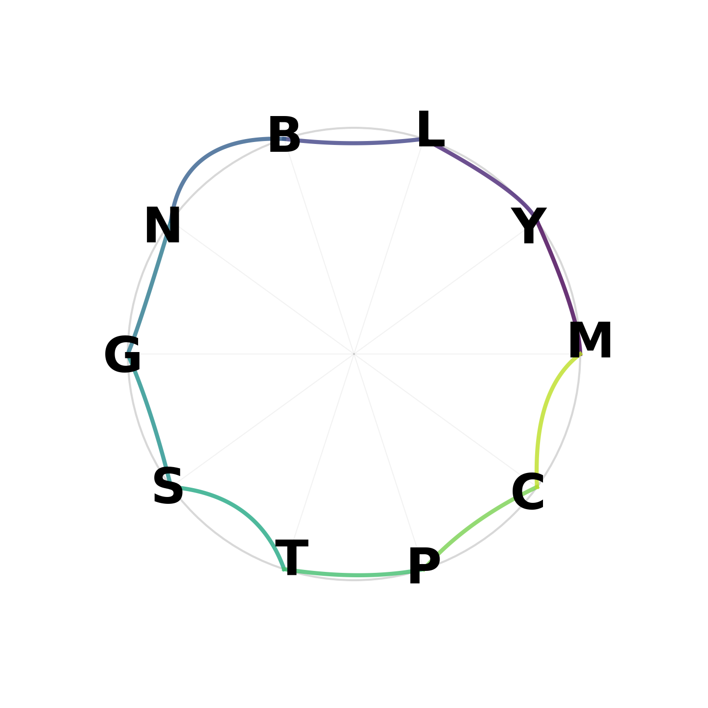

# Simple Chaos Sigil Maker

A Python-based tool to generate chaos sigils from statements of intent. Vowels are removed, duplicates eliminated, and letters are artistically connected on a circle with smooth curves and gradient colors for a more polished look.

## How it Works
- Input a statement (e.g., "May all beings be at peace").
- Vowels are stripped, duplicates removed (preserving order).
- Letters placed on a circle.
- Connected with quadratic Bezier curves for smoothness.
- Saved as `sigil.png`.

## Example


## Usage
```bash
python sigil_maker.py "Your statement here"
```

## Installation
Requires Python 3, matplotlib, and numpy:
```bash
pip install matplotlib numpy
```
